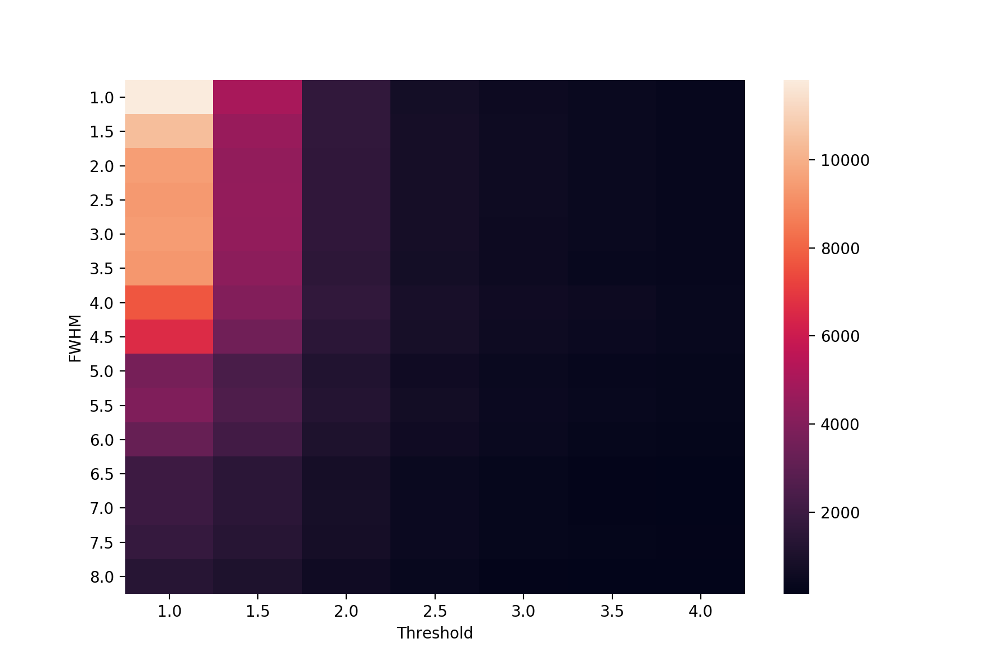
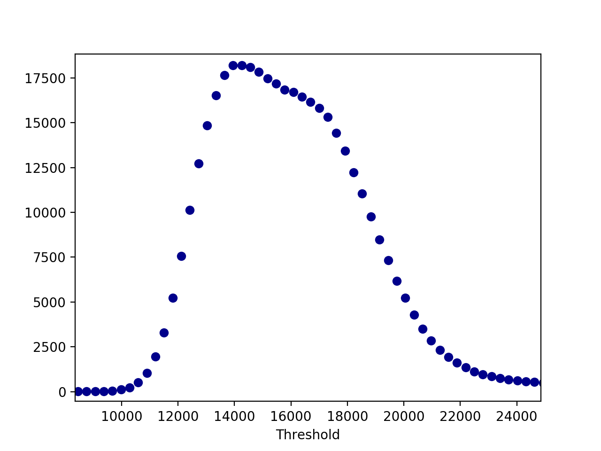
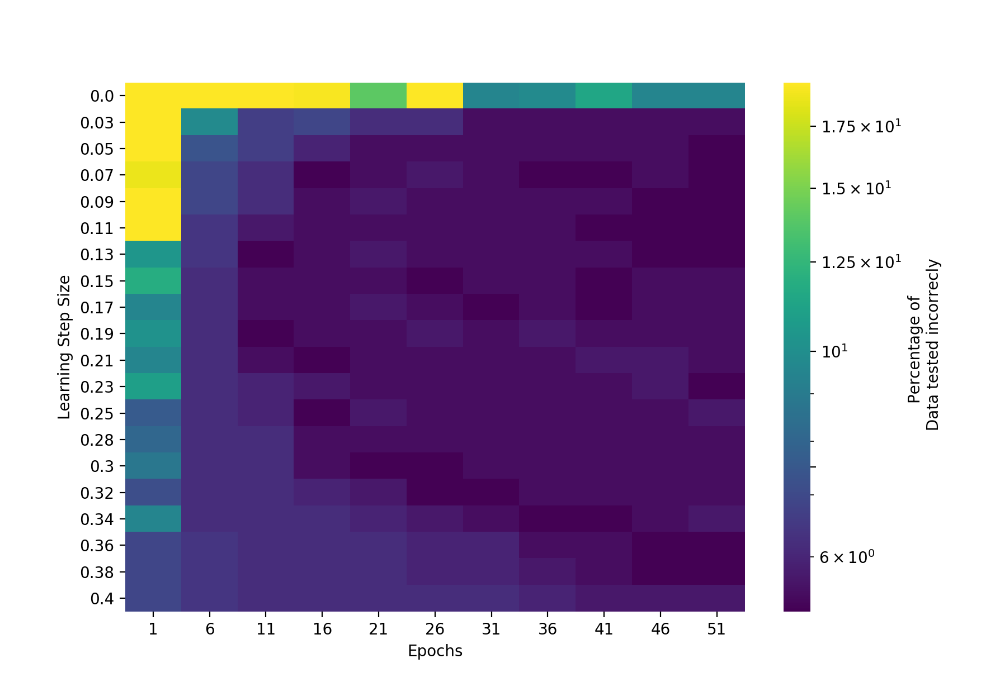

# Allsky-StarCounter
### Count the stars in an Allsky-image using different techniques and methods.

Needs to be changed depending on the type of input data but framework is there. 
 
final1_starfind.py -- Star-Finder Method using DAOFIND (Stetson 1987) in Photoutils Library 
final2_thresh.py -- Determining star count using threshold algorithm (detail in Bachelorthesis) 
final3_nn.py -- Determining star count using simple neural network (detail in Bachelorthesis) 
 

For Starfinder it is important to determine the right parameters. Use this matrix for that: 
  
For Threshold it is important to determine the right threshold. Use this threshold vs stars determined plot for that: 
  
For NN it is important to determine the right epochs/elarning rate. Use this matrix for that: 
  
